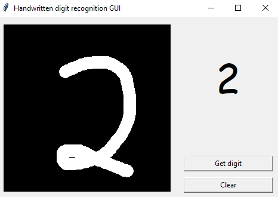

# Handwritten digit recognition GUI
My first Machine Learning project. It allows user to draw a number then predicts which digit it is. The model is made with neural network using Keras and Tensorflow, uses mnist dataset to train.

Inspired by DataFlair but worse cause i'm trash. Source: https://data-flair.training/blogs/python-deep-learning-project-handwritten-digit-recognition/

#Requirements

Tensorflow

Tkinter

Numpy

PIL

# Usage

Run program from ```number.py``` file. The network is from ```model.py```. I already saved it in ```model.h5```

Draw number on black board then press **Get digit**. Press **Clear** to clear the board. If it's wrong, don't worry cause i'm dumb.



